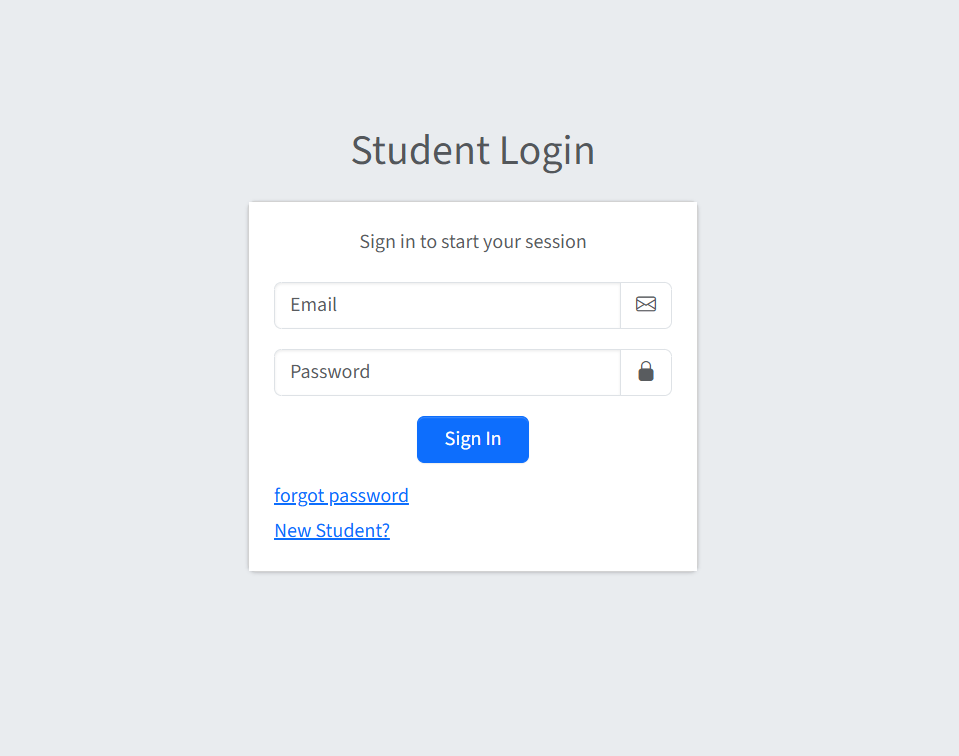
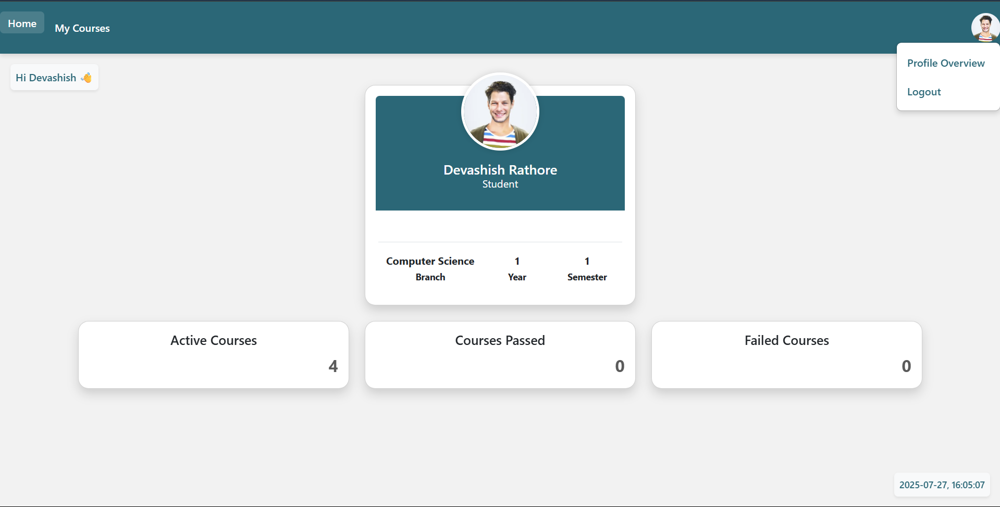
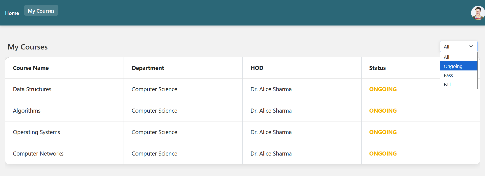
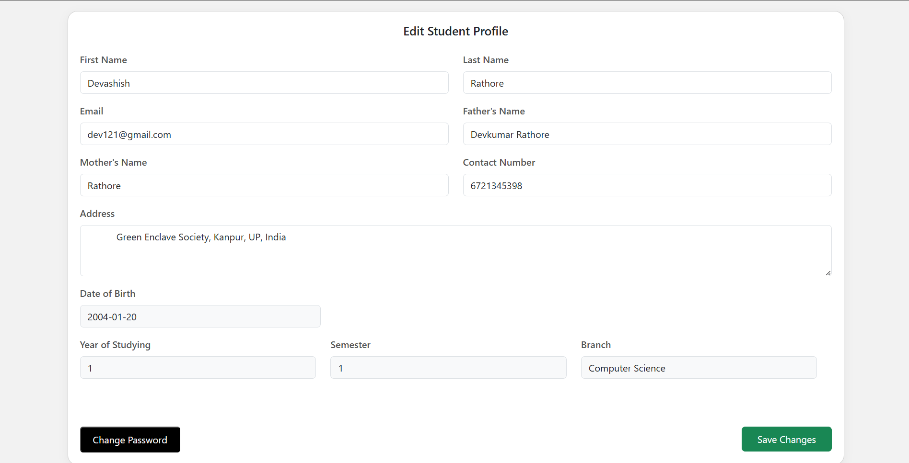
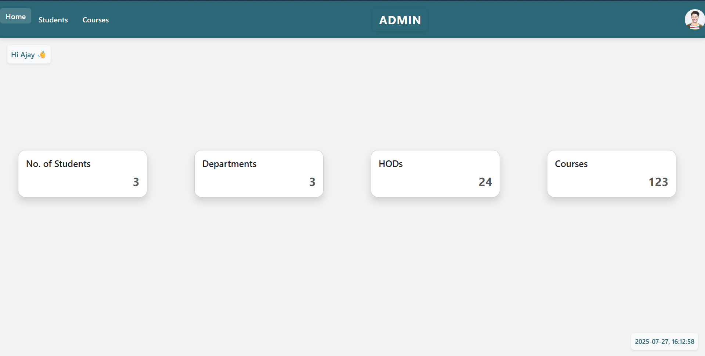
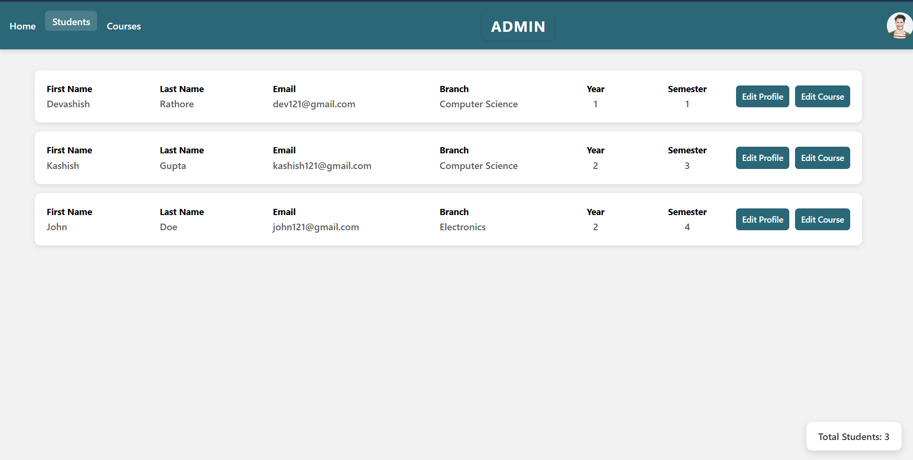
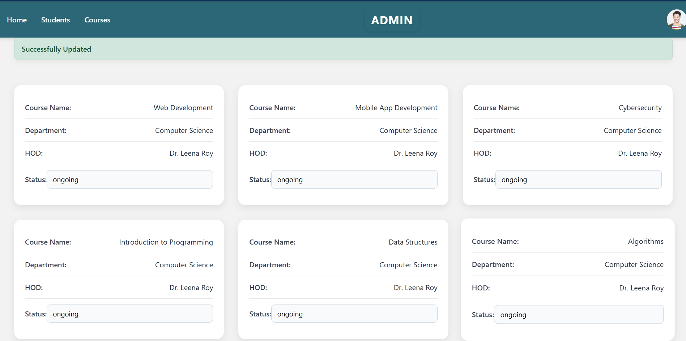

# 🎓 Student Management System

A robust, full-featured Student Management System built with **Django**, designed to simplify student performance tracking and course management. This web application allows students to view and manage their academic records, while administrators have full control over student data and course statuses. Email verification is integrated for secure user onboarding.

---

## 🚀 Features

### 👨‍🎓 Student Portal:
- View personal **profile information**
- Edit and update profile details
- Track **ongoing**, **passed**, and **failed** courses
- Analyze academic **performance statistics**

### 🧑‍💼 Admin Dashboard:
- Modify student profiles and details
- Change the **status** of student courses: `Ongoing`, `Passed`, or `Failed`
- View overall system and student **statistics**
- Full control over user data

### 📧 Email Verification:
- Secure sign-up process via **email confirmation**
- Ensures authenticity and prevents spam registrations

---

## 🛠️ Tech Stack

| Tech        | Purpose                      |
|-------------|------------------------------|
| **Python**  | Core programming language     |
| **Django**  | Backend web framework         |
| **SQLite**  | Default development database  |
| **HTML/CSS**| Templating and UI styling     |
| **JavaScript** | Interactivity (if applicable) |
| **SMTP**    | For sending email verifications |

---

## 📁 Project Structure (Simplified)

| Folder/File       | Description                              |
|-------------------|------------------------------------------|
| `ISMS_project`    | Main project config                      |
| `students/`       | Student app (models, views, templates)   |
| `templates/`      | GTML Files                               |
| `static/`         | Static assets (CSS/JS/static files)      |
| `manage.py`       |                                          |
| `requirements.txt`| Requirements needed for full setup       |
| `.gitignore`      | Git ignore rules                         |
| `README.md`       | Project documentation                    |

## Project Goals

The Student Management System aims to provide an intuitive and efficient platform for managing student data and academic progress. Key goals include:
- Allow students to update their profile details easily.
- Provide students with a clear overview of their ongoing, passed, and failed courses.
- Display personalized academic statistics for better self-assessment.
- Enable administrators to manage student details, update course statuses, and monitor overall system statistics.
- Integrate secure email verification to ensure user authenticity and security.
- Deliver a user-friendly interface with seamless navigation for both students and administrators.

## Image Gallery

  

  

  

  

 

  

  

## About the Author
Lakshay is a Computer Science Engineering student at Thapar Institute of Engineering and Technology with a passion for web development and software engineering. This project showcases his skills in Django framework, full-stack development, and secure authentication systems.

[Linked-In Profile](www.linkedin.com/in/lakshaya-mehta-92518323a)
